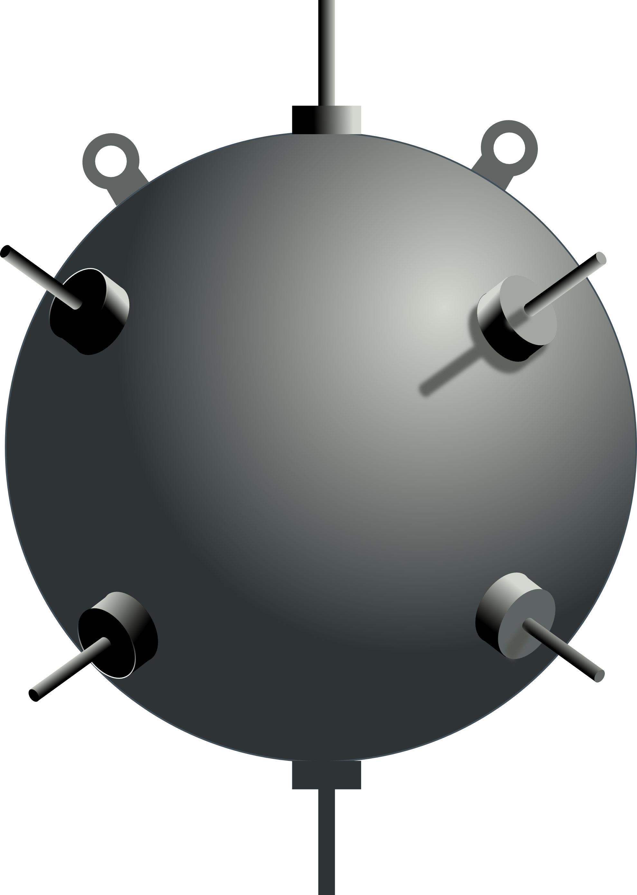
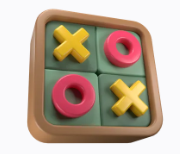

# PyFunZone 🐍

¡Bienvenido a **PyFunZone**! Aquí encontrarás una colección de juegos creados con Python y Tkinter.

## Juegos Disponibles

### 1. Buscaminas



**Descripción:** 
Desafía tus habilidades estratégicas y trata de no explotar una mina.

**[Ir al juego](juego-buscaminas)**

### 2. Cruz y Círculo



**Descripción:** 
Compite contra la máquina en este clásico juego de tres en línea.

**[Ir al juego](juego-tic-tac-toe)**

## Acerca de

**PyFunZone 🐍** es un proyecto que busca crear divertidos y desafiantes juegos utilizando Python y la biblioteca Tkinter. Cada juego es una oportunidad para aprender y mejorar habilidades de programación.

## Cómo Jugar

1. Clona el repositorio:
    ```bash
    git clone https://github.com/Oteiza-Jose/juegos-python.git
    ```

2. Navega hasta el directorio del juego que deseas jugar:
    ```bash
    cd juegos-python/juego-buscaminas
    ```

3. Ejecuta el juego:
    ```bash
    python minesweeper.py
    ```

## Contribuir

¡Las contribuciones son bienvenidas! Si tienes ideas para mejorar los juegos o agregar nuevos, siéntete libre de hacer un fork del repositorio, crear una rama y enviar un pull request.

---

Creado José Oteiza.
